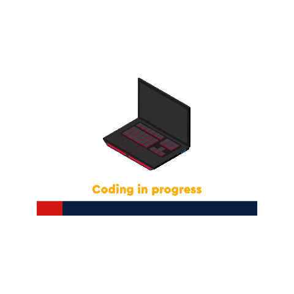

# Logan Edmonds

  

  
  `Digital Craftsman | Developer | Carpenter | Knowledge Seeker`

  

  

---

## About Me: 
I am a Full Stack Developer from Texas.

  * 📰 I'm currently working on a News Scraper
  * 🌱 I'm currently learning Python and Scrapy for Web Scraping!
  * I'm collaborating on a cryptocurrency portfolio tracker with [Tuxman](https://github.com/Tuxman)
  * In my free time I'm researching new technologies and brushing up on my LeetCode

---
 

### 🧰 Languages and Tools

 

  
  
  
  
  
  
  
  
  
  
  
  
  
  
  
  
  
  
  

